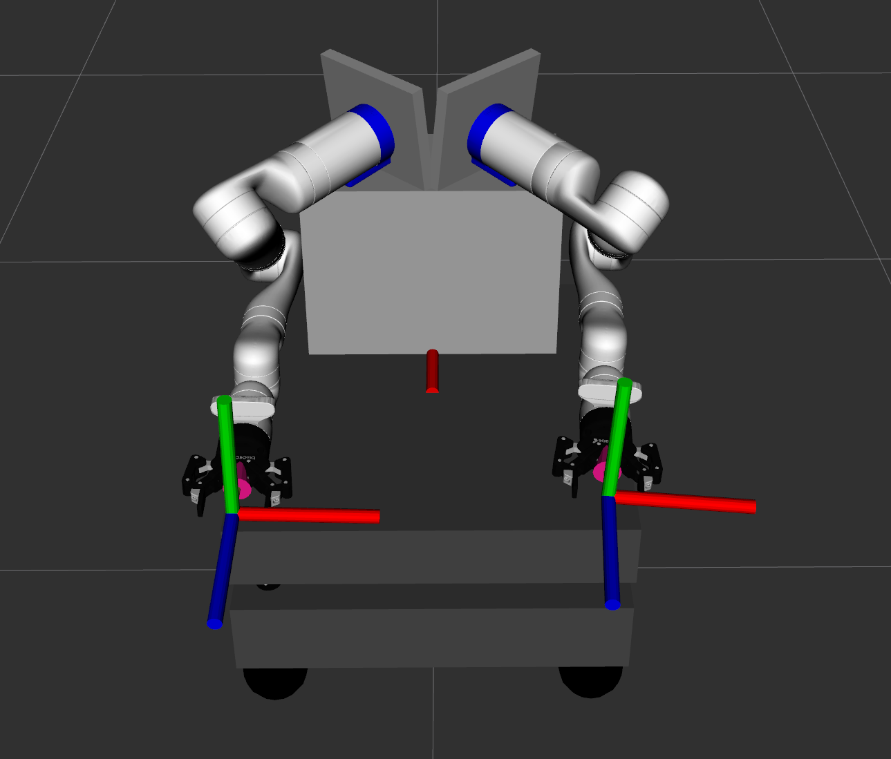

# Eddie Description

Robot description for the eddie robot in form of URDF files, controllers and meshes.
Gripper not added.

## Environment
Tested on:
  Ubuntu: 22.04
  ROS2: Humble

## Setup

- Clone this repository into your workspace
  
  ```bash
  # Create workspace
  mkdir -p ~/eddie_ws/src && cd ~/eddie_ws/src

  # Clone repository
  git clone https://github.com/a2s-institute/eddie_description.git -b gz-devel
  ```

- Build workspace

  ```bash
  cd ~/eddie_ws

  colcon build
  ```

## Usage

- View robot in rviz

  ```bash
  cd ~/eddie_ws

  # Source workspace
  source install/setup.bash

  # View robot in rviz
  ros2 launch eddie_description view_eddie.launch.py joint_state_gui:=false
  ```

- View robot in rviz with joint state gui

  ```bash
  ros2 launch eddie_description view_eddie.launch.py joint_state_gui:=true
  ```

## Eddie


